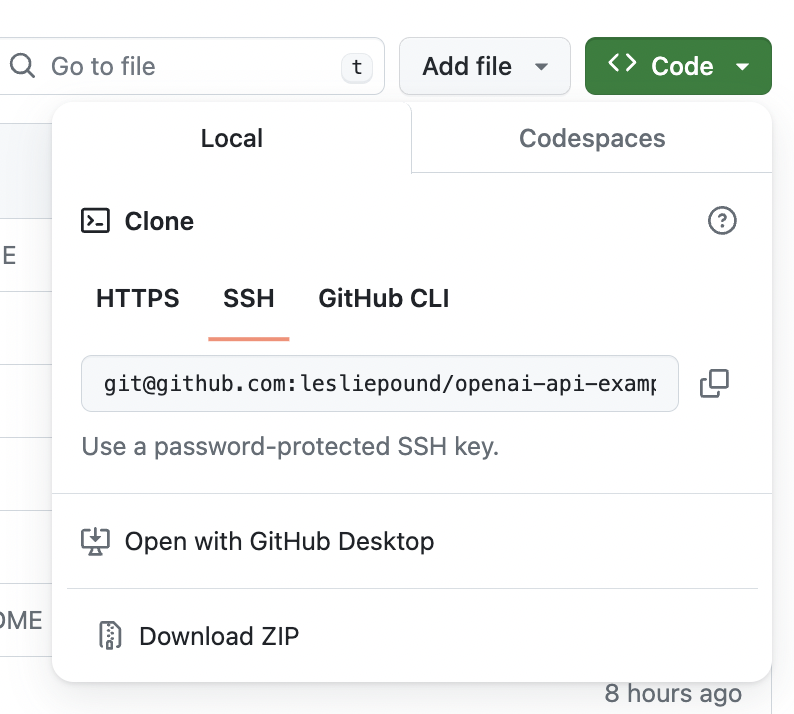

## OpenAI API Demos For Node 
### Simple web server for generative AI -OpenAI

This is a web server for multiple demos from OpenAI's Developer quickstart examples.


It was built with Node.js and uses the Express, body-parser,  openAI APIs for node.

This is a good place to start with building simple generative AI applications. Python is peferred, but node will do in a pinch.  Even if you don't plan to code, understanding how generative AI works is helpful in knowing how it works and what is possible.

We are headed toward programming in human language. This is a step in that direction. Not English, but simplier than other frameworks.

## Repository
https://github.com/lesliepound/openai-api-examples-node

## Requirements
Node,Express,OpenAI

## Installation
1. Download and install [Node](https://nodejs.org/en/download/).

2. Make a copy of this repository. This will be your <local_repo>.
New to github? Use Download Zip option.
   

3. Install Express  ```npm install express```  
_(installs node and npm)_

4. Form Help ```npm install body-parser```

5. Install Openai  ```npm install openai```
6. Setup openAI key in evironment variables.

This repository contains demos from the OpenAI Developer quickstart for the APIs in

|                   Name | Modules         | endpoint              |
|-----------------------:|-----------------|-----------------------|
|                        |                 | http://localhost:3000 |
|                        | src/modules/... | public/...            |
| text generation (chat) | chat.js         | /chat.html            |
|     adjust creatvivity | chat.js         | /temperature.html     |
|        prompt training | chat.js         | /fewshot.html         |
|              functions | functions.js    | /funcrions.html       |
|                 vision | visual.js       | /visual.html          |
|                  speak | stt.js          | /stt.html             |
|                 listen | tts.js          | /tts.html             |
|             moderation | moderation.js   | /moderation.html      |


 


### Start
```cd <local_repo>```

```node app.js```